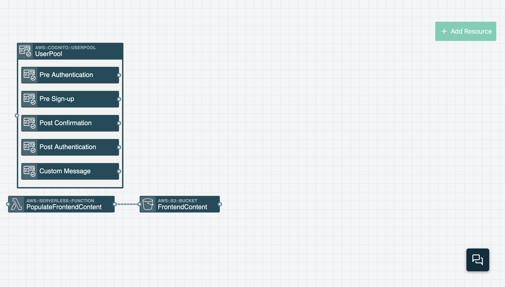
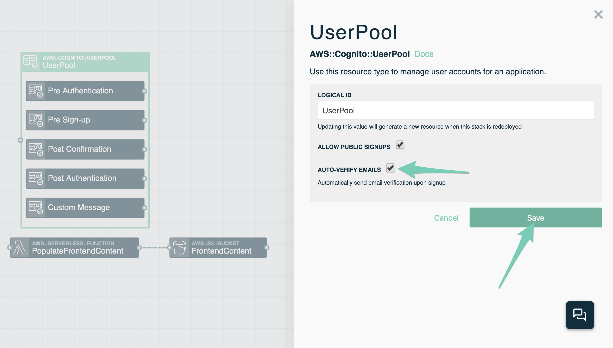
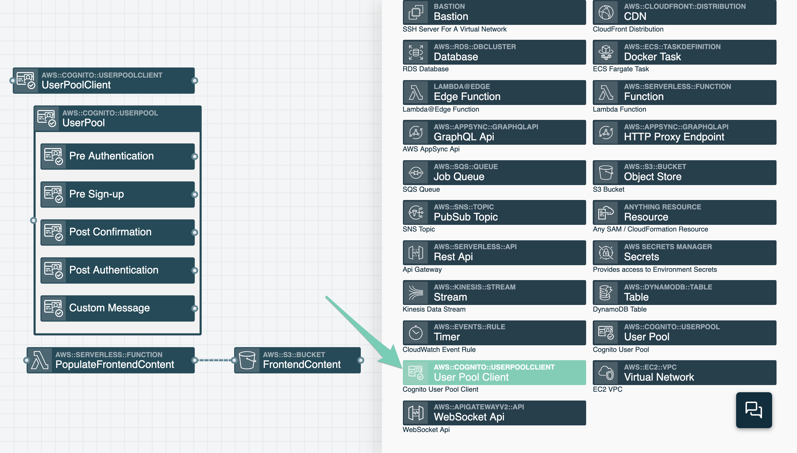
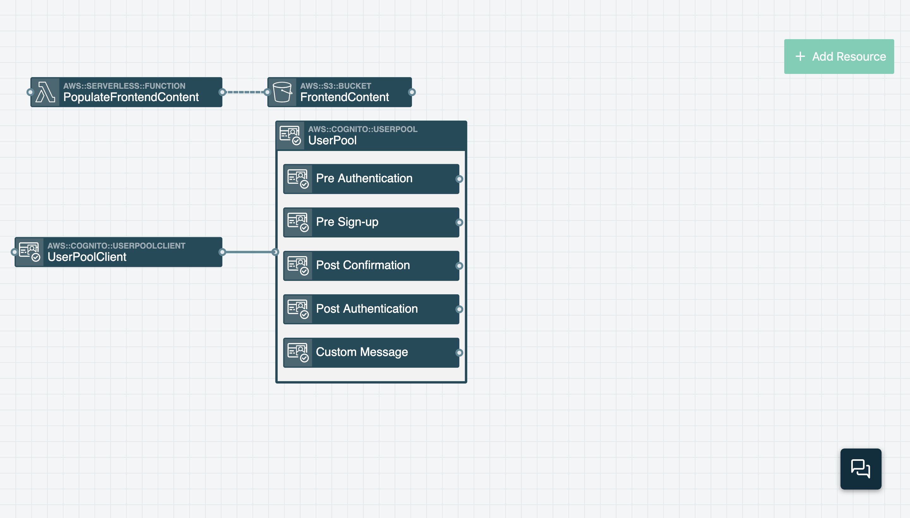
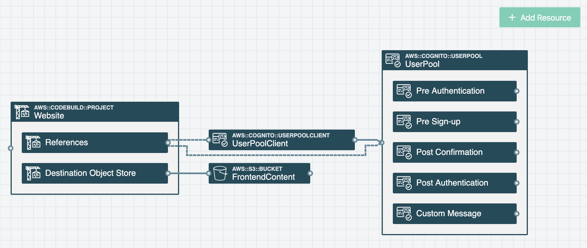
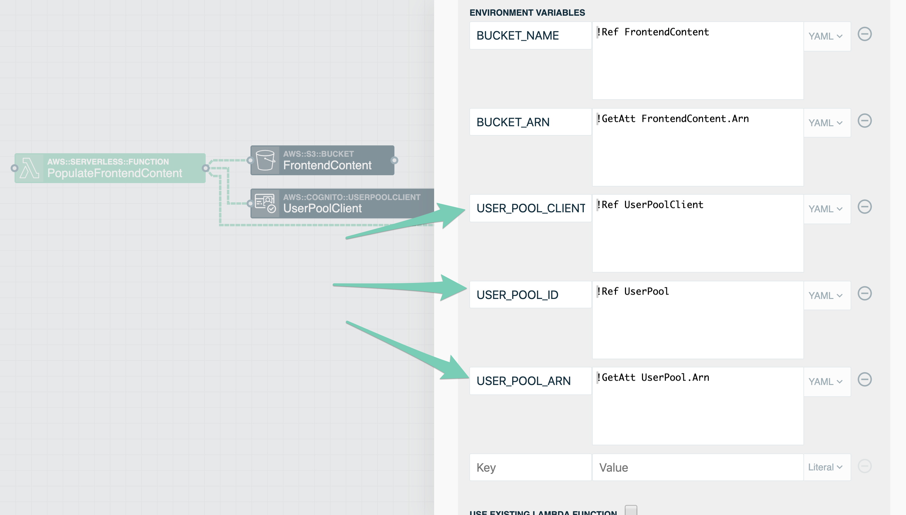
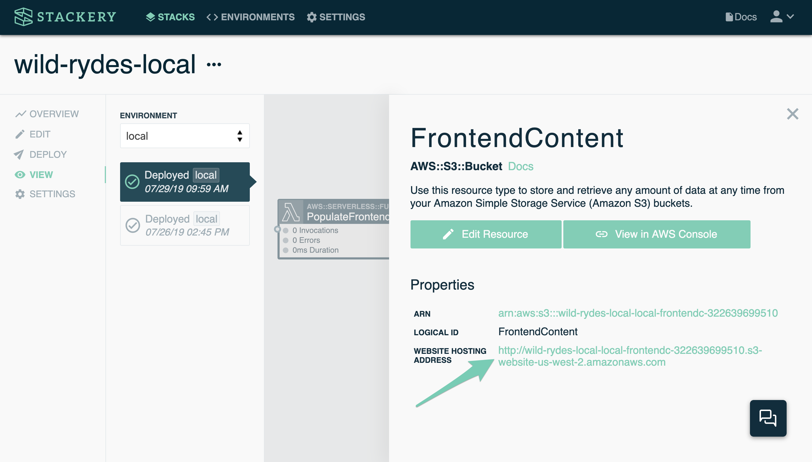
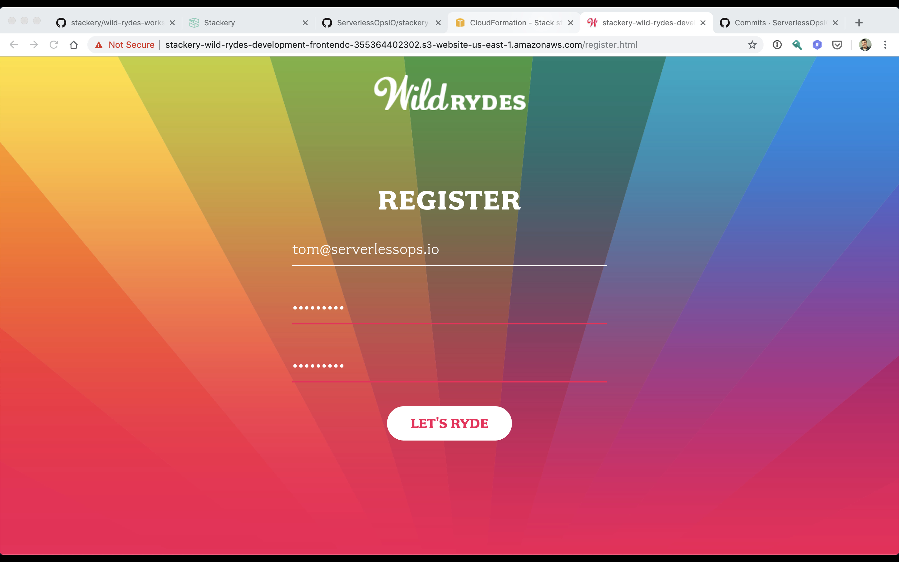

# User Management
You’ll now add user management to *Wild Rydes*. By adding AWS Cognito support to the application you can manage user sign ups and handle application authentication and authorization. Once implemented, you’ll head back to your application, sign up, confirm your email, and login to the application.

<!-- FIXME: Add more detail about Cognito, user pools, user pool clients -->

## AWS Services
<!-- FIXME: link to Stackery resource docs? -->

* AWS Cognito
  * User pools
  * User pool clients

## Instructions
Return to the visual editor in the browser (if it's no longer running, just enter `stackery edit` in the terminal from the root of your stack).

### 1. Add a User Pool resource

Add a Cognito User Pool resource to manage *Wild Rydes* users. Click the **Add Resource** button in the top right of screen. Then click on the _User Pool_ resource (or drag it) onto the canvas. This will add a new resource named _UserPool_ to the canvas. When you add the _UserPool_ resource to the canvas it will expand and contain a number of events. These events can be connected to Lambda functions if you want them to trigger custom actions during the sign-up or login process. _You won’t need to worry about these events in this workshop._




Now double-click on the *UserPool* resource to open up its configuration window. Enable the **AUTO-VERIFY EMAILS** setting and then click **Save**.




### 2. Add a User Pool Client resource

Add a User Pool Client resource to the application stack. Connecting a User Pool Client to a User Pool creates a User Pool Client ID which an application can use to access the User Pool and perform actions like adding users to the User Pool and authenticating those users. Click the **Add Resource** button and then click on the _User Pool Client_ resource. (You may need to scroll down through the list of resources.) This will add the _UserPoolClient_ resource to your application.




Next, drag a wire from the _UserPoolClient_ resource to the _UserPool_ resource. (Make sure you drag the line from the right end of the _UserPoolClient_ to the left end of the _UserPool_. You can rearrange resources on the canvas to make dragging the line between resources easier.)




### 3. Configure website content to authenticate users.

Now connect the _Website_ resource to the *UserPool* and *UserPoolClient* resources. Doing so will create environmental variables in the Website's configuration and those variable values will be used to populate the *js/config.js* object which will be stored in the _FrontendContent_ S3 bucket.

Start by connecting the _Website_ resource's _Reference_ connector to the _UserPool_ resource. Do this by dragging a wire from the right side of the _Website_'s _References_ to the left side of the _User Pool_ resource. Next, drag another wire from the right side of the _Website_'s _References_ to the left side of the _UserPoolClient_ resource.




Doing these actions will add environmental variable to the Website called **USER_POOL_ID** and **USER_POOL_CLIENT_ID**.




### 4. Deploy the stack again

```bash
git commit template.yaml -m 'Add user management'
git push origin HEAD
stackery deploy --env-name development
```

This will take a few minutes once again. Wait until it completes to continue on to the next step. You should see a readout saying the stack was successfully deployed.

### 5. Register as a new user
Once again, you can view your deployed stack in the Stackery app. Navigate back to the __View__ tab if you're not there already, then double-click the `FrontendContent` bucket resource and follow the website hosting address link.



In your web browser on the Wild Rydes home page add `/register.html` to the URL to make your way to the application registration page. Enter your email address, create a password, and confirm that password.

*NOTE: Your password must be at least 8 letters with uppercase and lowercase letters, numbers, and special characters*



Next, Click the **Let’s Ride** button where you’ll be directed to a new page while also receiving an email with a verification code. Enter the email address you signed up with and the verification code you received. Once you click **Verify** you will be redirected to the Wild Rydes login page where you can login using your email address and password from earlier.

Don't be alarmed when you login and are presented with an error. There's still more work to go!

## Next Steps

Proceed to the next module in this workshop:

* [Environment Parameters & Secrets](./03-environment-parameters.md)

