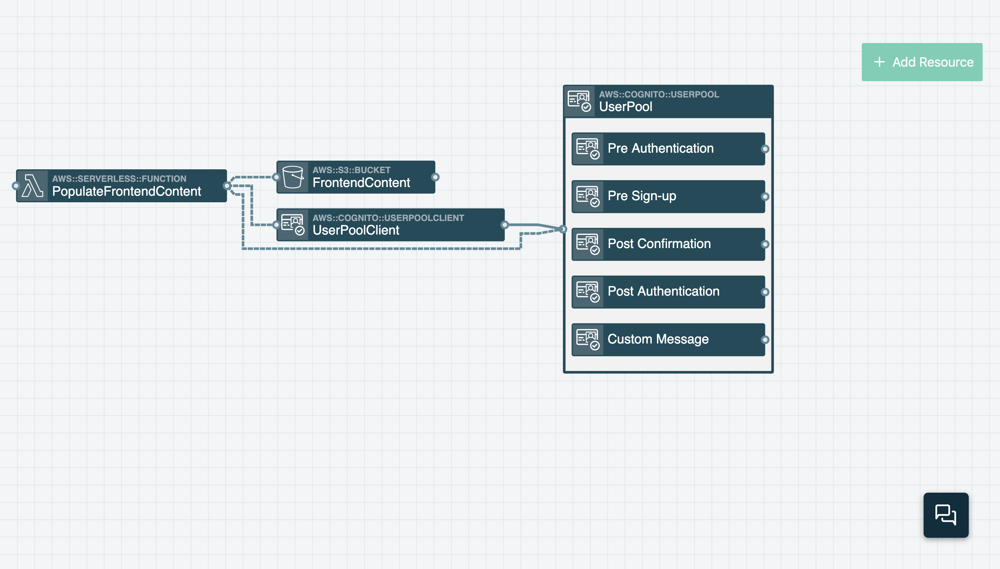

# User Management
You’ll now add user management to *Wild Rydes*. By adding AWS Cognito support to the application you can manage user sign ups and handle application authentication and authorization. Once implemented, you’ll head back to your application, sign up, confirm your email, and login to the application.

<!-- FIXME: Add more detail about Cognito, user pools, user pool clients -->

## AWS Services
<!-- FIXME: link to Stackery resource docs? -->

* AWS Cognito
  * User pools
  * User pool clients

## Instructions
Return to the visual editor by clicking **EDIT** in the left sidebar from the template editor if you have not done so already.

### 1. Add a User Pool resource

Add a Cognito User Pool resource to manage *Wild Rydes* users. Click the **Add Resource** button in the top right of screen. Then click on the _User Pool_ resource (or drag it) onto the canvas. This will add a new resource named _UserPool_ to the canvas. When you add the _UserPool_ resource to the canvas it will expand and contain a number of events. These events can be connected to Lambda functions if you want them to trigger custom actions during the sign-up or login process. _You won’t need to worry about these events in this workshop._

Now double-click on the *UserPool* resource to open up it’s configuration window. Enable the **AUTO-VERIFY EMAILS** setting and then clock **Save**.

### 2. Add a User Pool Client resource

Add a User Pool Client resource to the application stack. Connecting a User Pool Client to a User Pool creates a User Pool Client ID which an application can use to access the User Pool and perform actions like adding users to the User Pool and authenticating those users. Click the **Add Resource** button and then click on the _User Pool Client_ resource. (You may need to scroll down through the list of resources.) This will add the _UserPoolClient_ resource to your application.

Next, drag a wire from the _UserPoolClient_ resource to the _UserPool_ resource. (Make sure you drag the line from the right end of the _UserPoolClient_ to the left end of the _UserPool_. You can rearrange resources on the canvas to make dragging the line between resources easier.)

### 3. Configure website content to authenticate users.

Now connect to the _PopulateFrontendContent_ Function to the *UserPool* and *UserPoolClient* resources. Doing so will create environmental variables in the Function’s configuration and those variable values will be used by the _PopulateFrontendContent_ Function to populate the *js/config.js* object which will be stored in the _FrontendContent_ S3 bucket.

Start by connecting the _PopulateFrontendContent_ Function to the _UserPool_ resource. Do this by dragging a wire from the Function to the User Pool. Next, drag a wire from the _PopulateFrontendContent_ Function to the _UserPoolClient_ resource.

Doing these actions will add environmental variable to the function called **USER_POOL_ID** and **USER_POOL_CLIENT_ID**.

### 4. Deploy the stack again

Commit your updates and deploy the updated AWS stack. Start by clicking the **Commit** button on the left of the screen and then click the **Commit and Push** button.

Next click **Deploy** in the left sidebar to enter the Deploy view. Next click **Prepare new deployment** for the **development** environment. For the **branch or SHA** value enter `master` and then click **Prepare Deployment**. Once the preparation completes (this should take about 20 seconds), click the **Deploy** button to open AWS CloudFormation. Then click the **Execute** button in the CloudFormation Console to add the Cognito User Pool and User Pool Client.

### 5. Register as a new user
In your web browser on the Wild Rydes home page add `/register.html` to the URL to make your way to the application registration page. Enter your email address, create a password, and confirm that password. 

*NOTE: Your passord must be at least 8 letters with uppercase and lowercase letters, numbers, and special characters*

Next, Click the **Let’s Ride** button where you’ll be directed to a new page while also receiving an email with a verification code. Enter the email address you signed up with and the verification code you received. Once you click **Verify** you will be redirected to the Wild Rydes login page where you can login using your email address and password from earlier.

Don't be alarmed when you login and are presented with an error. There's still more work to go!

## Next Steps

Proceed to the next module in this workshop:

* [Environment Parameters & Secrets](./03-environment-parameters.md)

