# Backend API
You'll now add the backend service for handling ride requests from *Wild Rydes* users. You'll create an HTTP API that will take requests from your frontend. The backend will reserve a unicorn and direct it to your user's location. Your backend API will use API Gateway to handle HTTP requests plus a Lambda function to process the request. You'll also see the Stackery environment variables you previously configured.

## AWS Services

<!-- FIXME: link to Stackery resource docs? -->

- AWS API Gateway
- AWS Lambda
- AWS Systems Manager (SSM) Parameter Store.
- AWS Secrets Manager


## Instructions
Go back to the terminal in the root of the *stackery-wild-rydes* stack directory. Re-start the visual editor by typing `stackery edit`.


### 1. Add an HTTP API resource
Add an HTTP API resource to the application stack. Click **Add Resources** and then click on the HTTP API resource. This will add an AWS API Gateway to your stack which will handle web requests to the backend service.

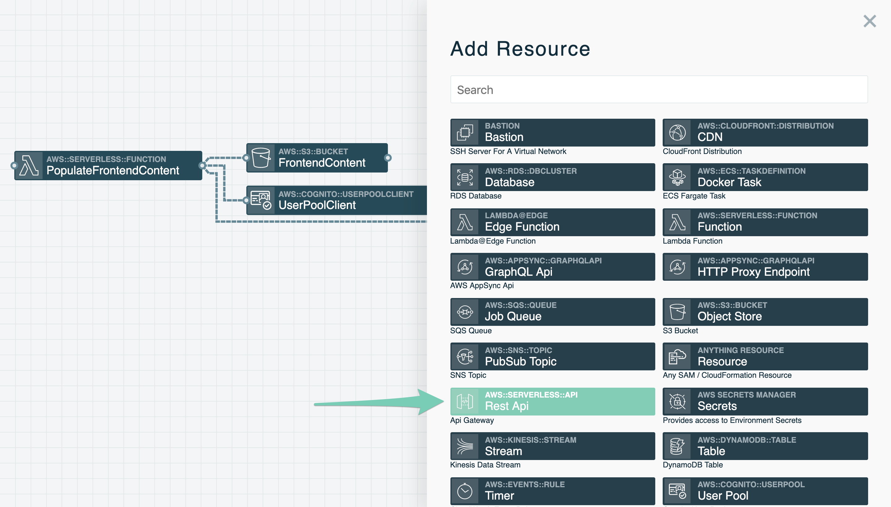

<!-- FIXME: We should explain CORS -->
Double-click on the newly added resource, which should be named *HttpApi*, to open up its configuration. Modify the **Routes** setting so there is one route, a `POST` action to the `/ride` endpoint.

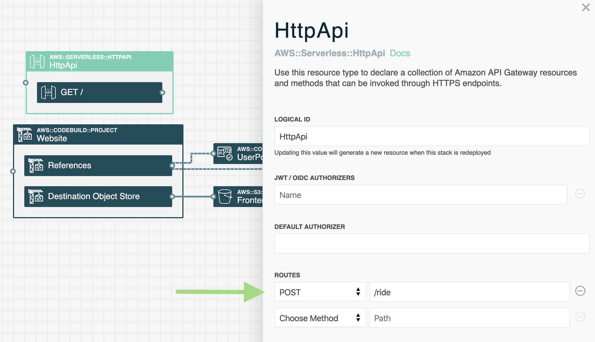

Next scroll down and check **SET CORS ALLOWED ORIGINS** and enter `- '*'` for **CORS ALLOWED ORIGINS** to allow browser requests from any domain (like our S3 Bucket Website). Check **SET CORS ALLOWED HEADERS** and leave the defaults for **CORS ALLOWED HEADERS** to allow browsers to send requests with Authorization and Content-Type headers. Lastly, check **SET CORS ALLOWED METHODS** and leave the default of `- '*'` for **CORS ALLOWED METHODS** to allow any HTTP method requested by a browser. Scroll down to the bottom and hit the **Save** button.

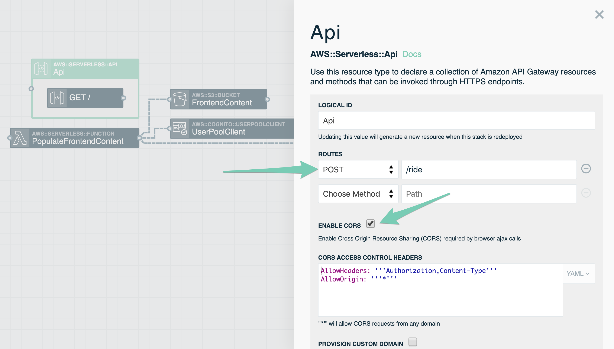


### 2. Add a Function resource to service API requests

When a *POST* request is made to the */ride* endpoint it should trigger a Lambda function to perform an action. You will add this function and connect the *Api* resource to this function so a web request will trigger it.

Add a Function from the *Add Resources* menu and then click on the newly added resources in the visual editor. Change the **LOGICAL ID** to `RequestUnicorn` and the **SOURCE PATH** to `src/RequestUnicorn`.

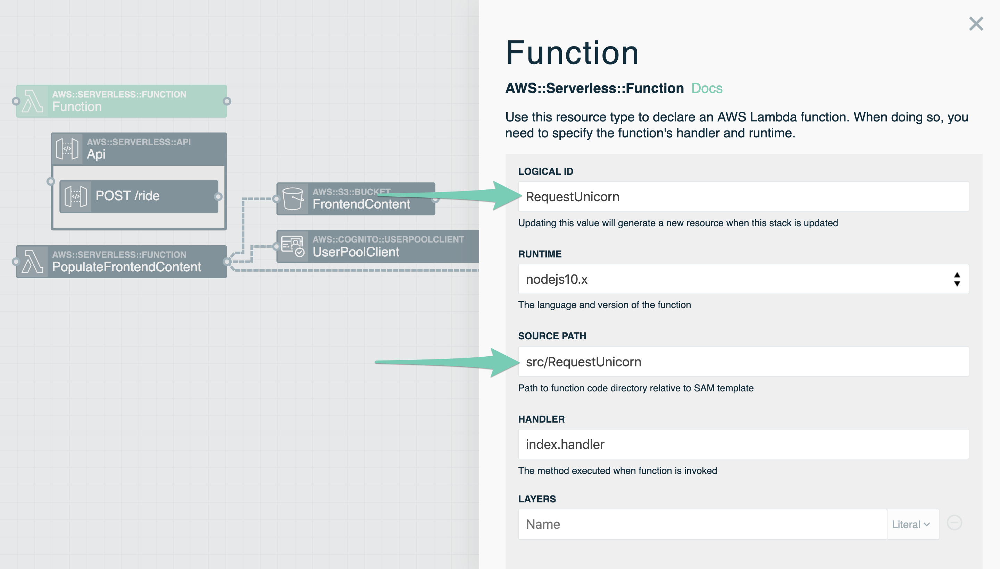


Scroll down to **ENVIRONMENT VARIABLES**. Add one named `UNICORN_STABLE_API` in the `Key` field. On the right in the dropdown that says **Literal** change it to **Param** and then enter the value `unicornStableApi`. This will have Stackery pull the value for *unicornStableApi* that you entered in Environment Parameters in the previous module. Then click **Save**.

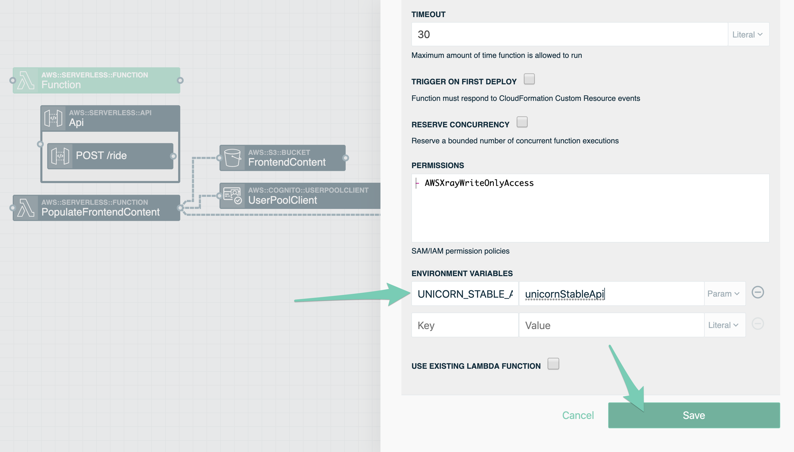


Next, draw a line from the *POST /ride* resource inside the *Api* resource to the *RequestUnicorn* Function.

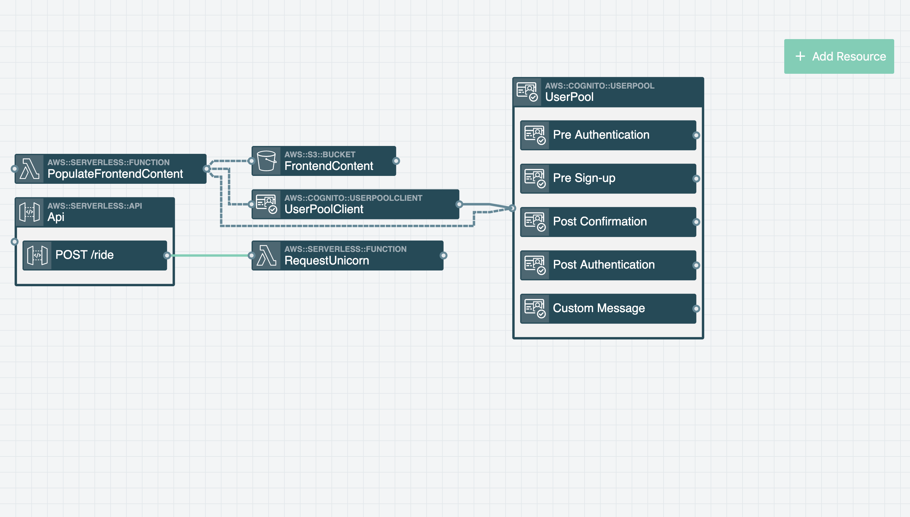


### 3. Add a Table resource for saving ride records

Add a Table resource from the *Add Resources* menu and click on it to open the table's configuration. For **LOGICAL ID** enter `Rides` and for **HASH KEY NAME** enter `RideId` and then save settings.

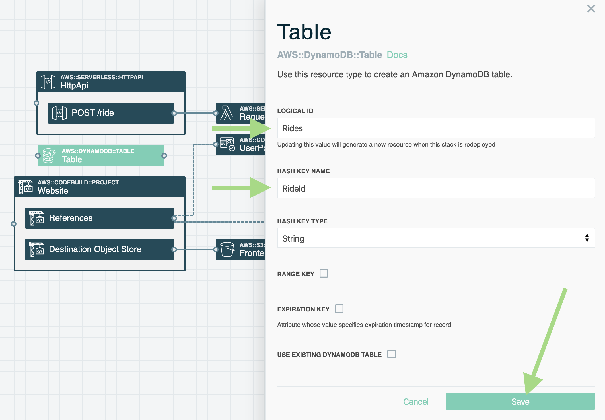

Next drag a wire from the right side of the *RequestUnicorn* Function to the *Rides* Table. This will add the `TABLE_NAME` environment variable so the function can access the table and adds permissions for the function to manipulate records.

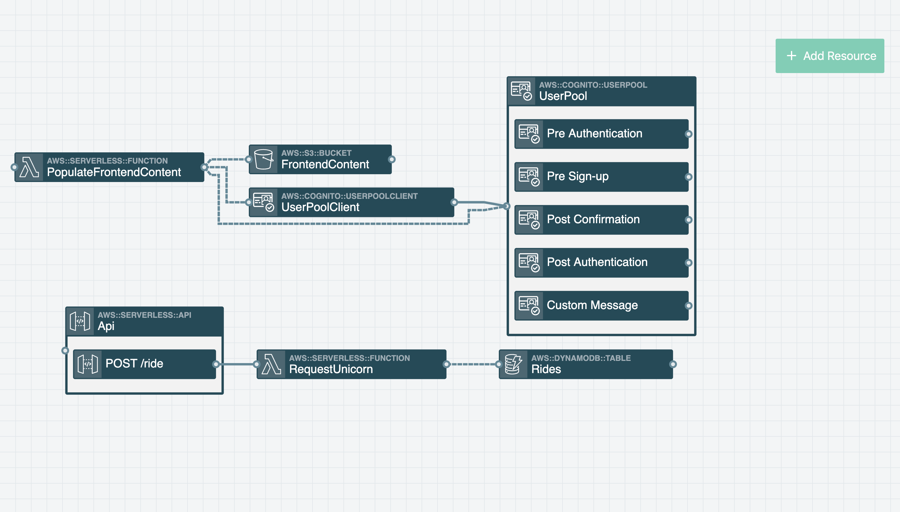


### 4. Add a Secrets resource to *RequestUnicorn* Function

Add a Secrets resource from the *Add Resources* menu to allow the *RequestUnicorn* Function to access the Unicorn Stables™ API key. Drag a wire from the right side of the *RequestUnicorn* Function to the new Secrets resource. This adds a permission for the function to read secrets from AWS Secrets Manager. It also adds an environment variable `SECRETS_NAMESPACE` to make it easier to locate the correct secrets for the environment the stack is deployed into.

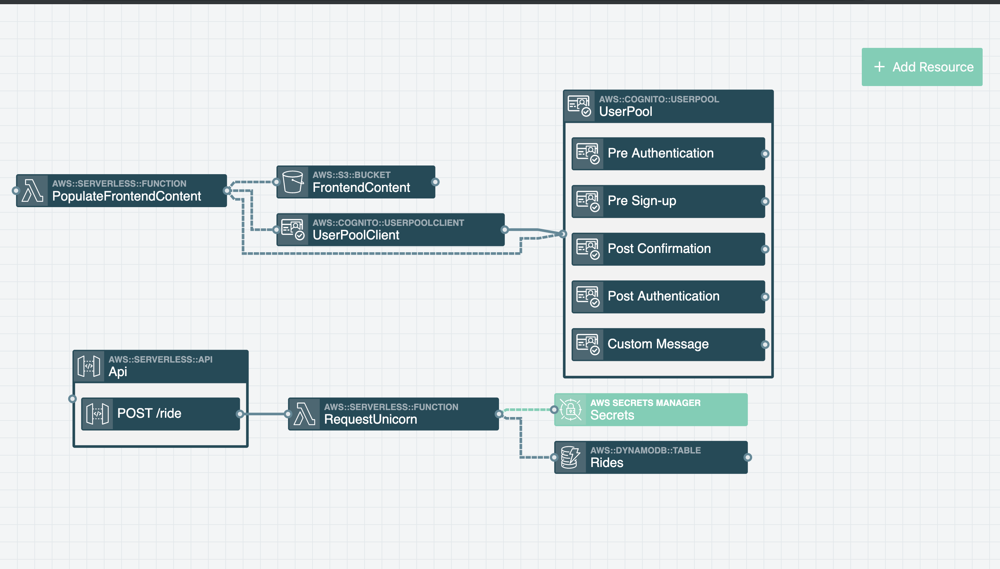


### 5. Point the *Website* Builder to the *Api* URL.

Drag a wire from the right side of the *Website* resource's *References* connector to the left side of the *Api* resource. Doing this adds the `API_URL` environment variable to the website builder. The *Website* resource uses the environment variable to generate *js/config.js* as part of the website content.


### 6. Authorize requests using the User Pool Client

Requests to *POST /ride* must have a valid User Pool authentication token in the `Authorization` header. Open the *HttpApi* resource, create an authorizer named `Authorizer`, and set it as the **DEFAULT AUTHORIZER**. This will ensure that requests made to every route of the API must be authorized with a JWT token in the `Authorization` HTTP header. Scroll to the bottom and save the settings.

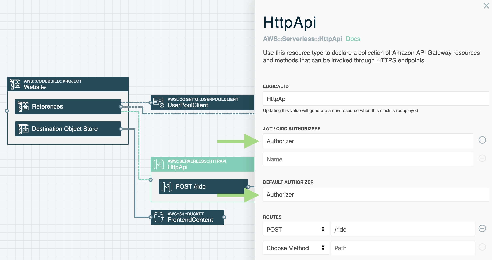

This will create a new *Authorizer* connection point for the *HttpApi* resource. Drag a wire from the right side of the *Authorizer* of the *HttpApi* resource to the left side of the *UserPoolClient* resource. This will require JWT authorization tokens in API requets to match those from our *UserPoolClient* resource.

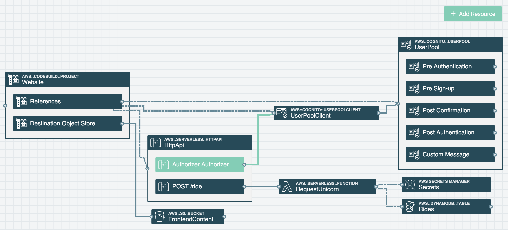


### 7. Update *RequestUnicorn* Function.

Update the *RequestUnicorn* Function code so it is functional. The code accepts requests and performs the following actions:

* Retrieves the username from the *Authorization* header from API Gateway
* Retrieves the Unicorn Stables™ API key from AWS Secrets Manager and caches the value for subsequent requests
* Makes a request to the Unicorn Stables™ endpoint to rent a unicorn
* Records the ride to the *Rides* DynamoDB table
* Returns with the response to the frontend website request

Copy [src/RequestUnicorn/index.js](src/RequestUnicorn/index.js) from the workshop directory (also created in module 1) into your project directory.

*Note: Make sure you are still in the stackery-wild-rydes project directory when you run the following command. You can stop the local server with `CTRL+C`, then enter:*

```bash
cp ../wild-rydes-workshop/src/RequestUnicorn/index.js ./src/RequestUnicorn/index.js
```

If you open `./src/RequestUnicorn/index.js`, you will see the updated code:

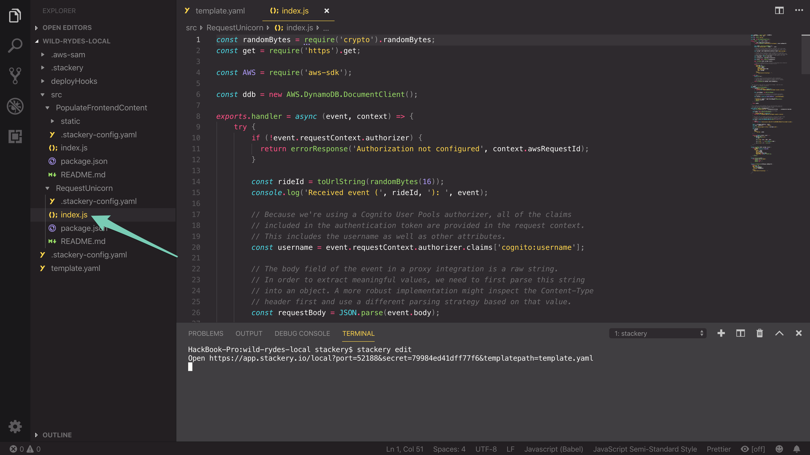

### 8. Deploy updated Wild Rydes

You'll now deploy the updated *stackery-wild-rydes* stack:

```bash
git add template.yaml src/ReqestUnicorn
git commit -m 'Add RequestUnicorn function'
git push origin HEAD
stackery deploy --env-name development
```

Once again, this will take a couple of minutes.

### 9. Request a unicorn

When your deployment is done, head back to the *Wild Rydes* website (with `/ride.html` added to the address). If the error message from module 2 is still up, refresh the page. Then right click on the map to drop a pin. After that click **Request Unicorn**. A unicorn will fly in from the edge of the screen towards your location pin. Huzzah! 🦄

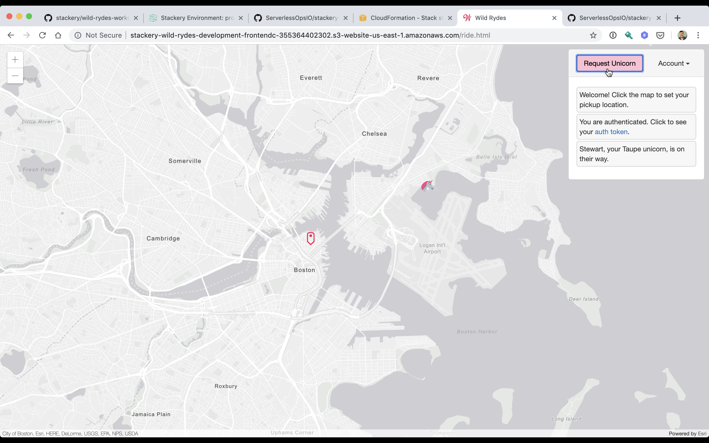

## Next Steps

Proceed to the next module in this workshop:

* [Production Deployment](./05-production.md)

