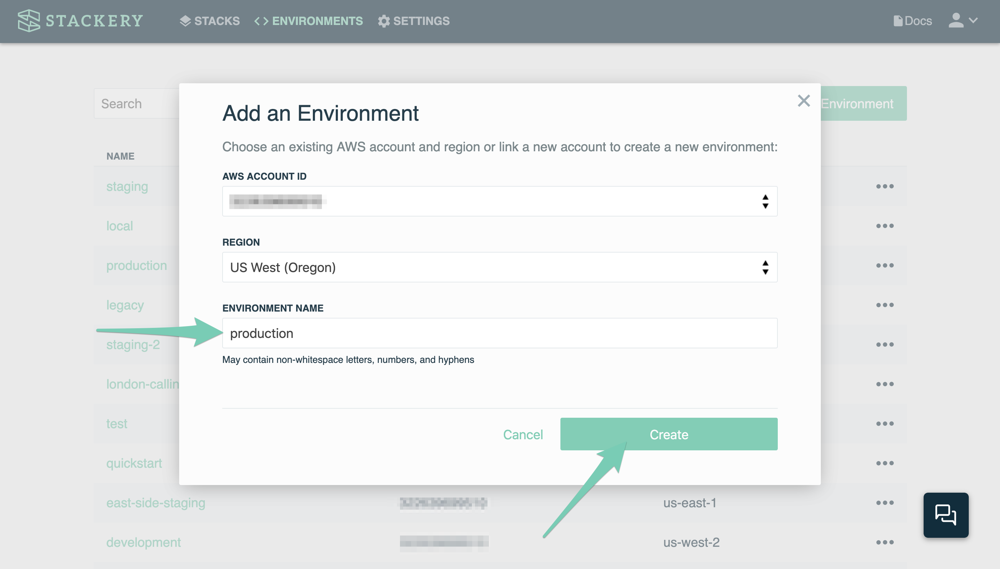
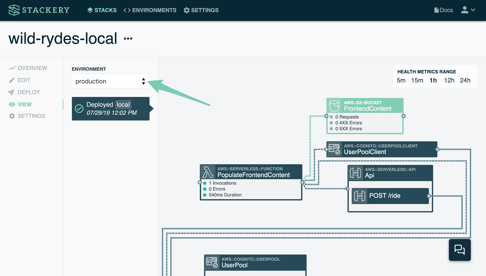

# Production Deployment.
Now that we've provisioned a *development* version of the service, you will provision a *production* version. You'll repeat many of the previous steps you've just completed. When finished you'll have an entirely new *production* instance of *Wild Rydes* running along side your *development* instance.

## Instructions
### 1. Create a *production* environment
Navigate to the *Environments* view at the top of the dashboard screen. Click the **Add an Environment** button. Choose an AWS account that you have linked to Stackery in the drop down menu. (Your development and production environments can live in the same account or be separate AWS accounts.) Name the environment `production` and then click **Create**.



### 2. Add a *production* Environment Parameter for Unicorn Stable API.
Click on **ENVIRONMENTS** at the top of the Stackery screen to be brought to your list of AWS environments. Click on the *production* environment. On the left hand sidebar click on **PARAMETERS** and add the following parameter value:

```JSON
{
  "unicornStableApi": "6k83qcdlb1.execute-api.us-east-1.amazonaws.com/development"
}
```

Once you have done that, click the **Save** button in the lower right. This will save the contents of *Environment Parameters* as parameters in SSM Parameter Store.

### 3. Add a *production* Environment Secret for the API key

Now click on **SECRETS** in the left sidebar. *Environment Secrets* section. Click the **Add New Secret** button on the right. In the new screen that appears enter the following and then click the **Update** button.

* **SECRET NAME:** *unicornStableApiKey*
* **SECRET VALUE**: *R7jeufY43d5sB9HYBNCKJ3N7pCjqFm7aNF9KxHF3*


### 4. Deploy the stack to the *production* environment

You'll now deploy the *stackery-wild-rydes* stack to the production *environment*. In the terminal in the root of your stack, enter:

```bash
stackery deploy -e production
```

This will take a few minutes again.

### 5. Test requesting a unicorn in production.
Now you can visit your Wild Rydes website that you have deployed.

Once the deployment is complete, open the Stackery app and navigate to the *stackery-wild-rydes` stack's __View__ tab. Choose the __production__ environment from the environment dropdown if it wasn't automatically selected:



Double-click the *FrontendContent* Object Store resource to view its details. On the details page click on the **Website Hosting Address** link to open the website. You can now walk through the signup process and login to request a unicorn just as you did in the development environment.

## Next Steps

Proceed to the next module in this workshop:

* [Application Observability](06-application-observability.md)

