# Application Observability
In this module, you will integrate [Lumigo](https://lumigo.io) with your Stackery application.

## Instructions

### 1. Update the application 
In this step, we will use a more complex serverless application. To deploy it, switch to the `monitoring` branch of this repository:

```bash
cd ../wild-rydes-workshop/
git fetch
git checkout monitoring
cd ..
```

Now copy the content over to your local application:

```bash
rm -r stackery-wild-rydes/src
cp -a wild-rydes-workshop/src stackery-wild-rydes/src
```
```bash
cp wild-rydes-workshop/template.yaml stackery-wild-rydes/template.yaml
```

You'll now deploy the updated *stackery-wild-rydes* stack:

```bash
stackery deploy -e production --aws-profile <your-aws-profile-name>
```

This will again take a few minutes.

### 2. Integrate Lumigo
Next, let's integrate Lumigo to our application. To get started with Lumigo, take the following steps. A more detailed guide can be found at [the Lumigo documentation](https://docs.lumigo.io/docs/create-an-account).

#### Create an Lumigo account
Click on the link below to bring you to the Lumigo signup page.

* [Create an Lumigo Account](https://platform.lumigo.io/signup)

#### Tell us a bit about yourself
Once you created your account, Lumigo will guide you through the integration. First, fill in some details:
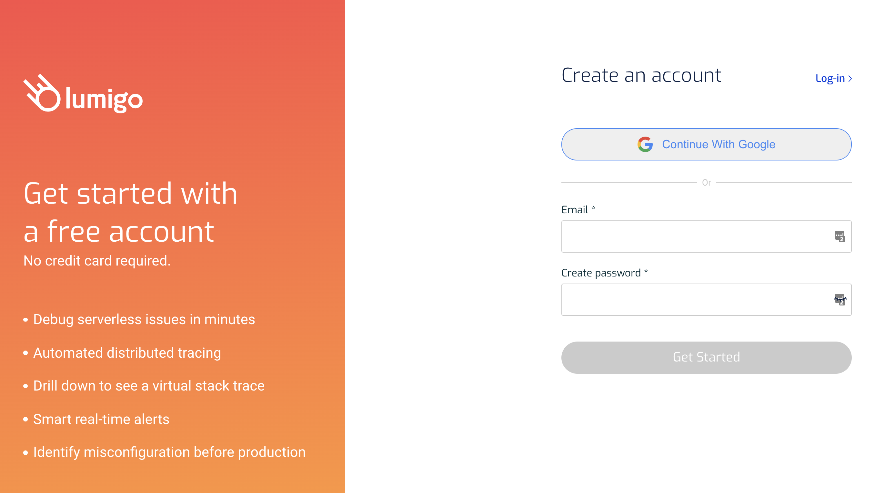

#### Link Lumigo to your AWS account
Next, we will link Lumigo to our AWS account. To do so all that is required is deploying our CloudFormation stack to your account. A more detailed walkthrough of this step can be found [here](https://docs.lumigo.io/docs/connect-your-environment).

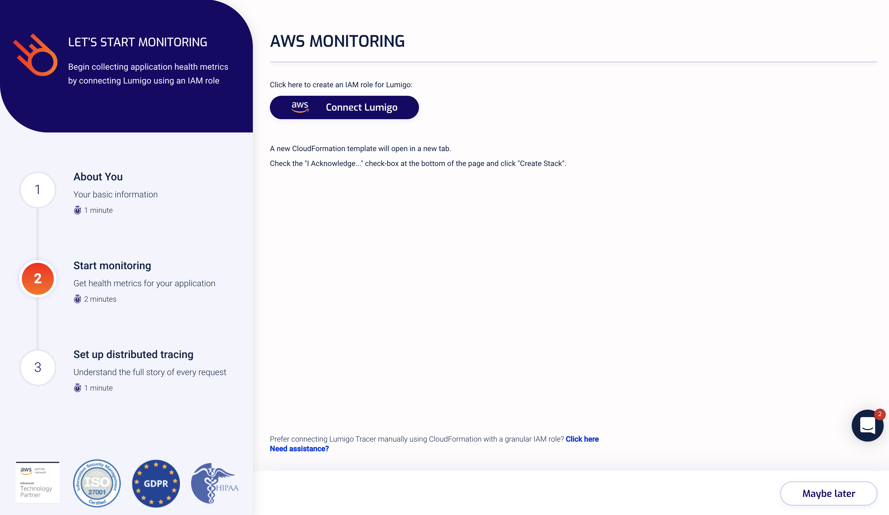

### Integrate Lumigo with Auto-Tracing
Next, you should land at the instrumentation step, which will let us choose functions to trace:

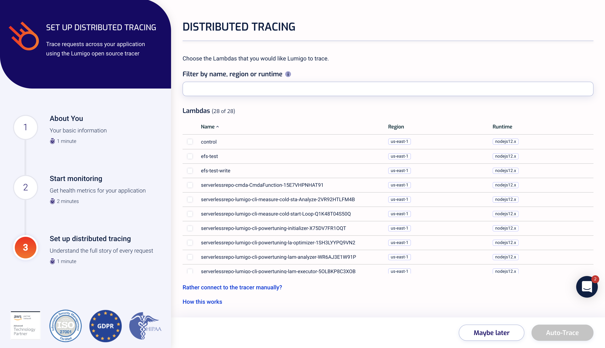

You can also do this after the initial setup too. Just head over to the [Functions](https://platform.lumigo.io/functions) page at any time, and you can auto-trace any function there:

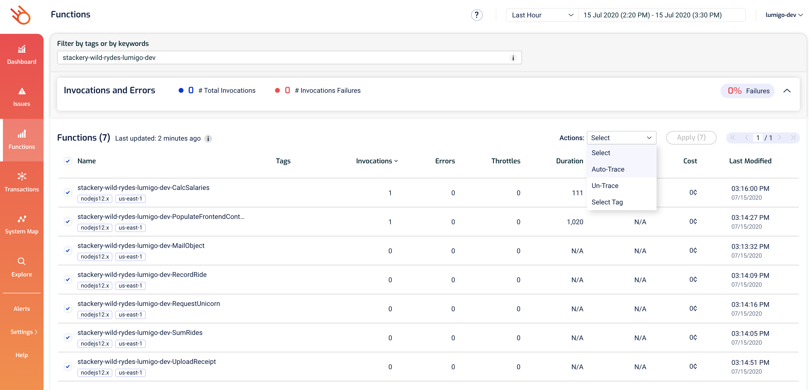

Lumigo will automatically start monitoring your application. Order some unicorn rides, and let's see what's going on in Lumigo!

### 3. View your application
Lumigo will trace the invocations of your application. The first thing we will use it for is to get an understanding of how our application looks in real life.

Click on the [System map](https://platform.lumigo.io/system-map) to have an overview of your application's architecture:
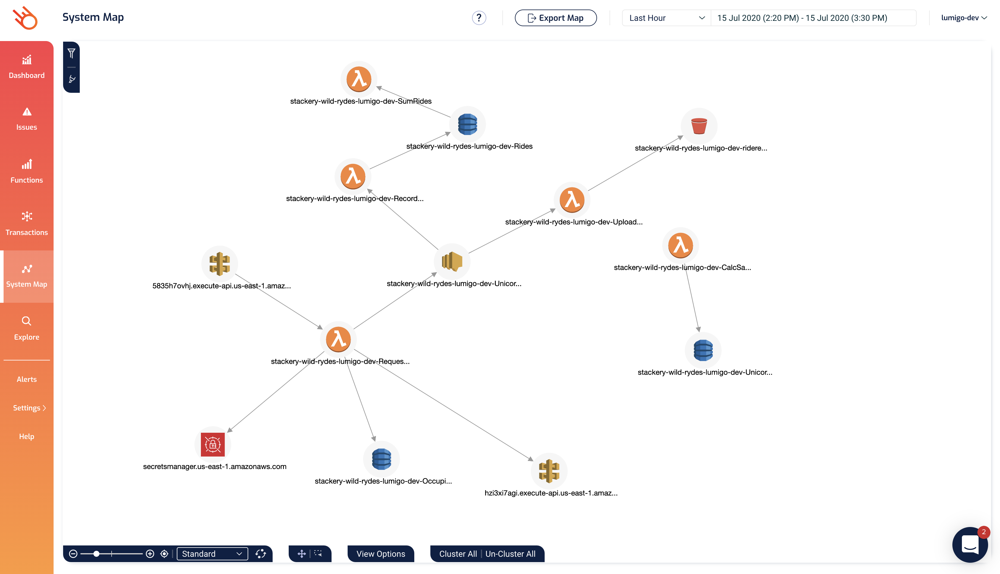

Explore the different functions' stats and invocations in your account using the [Functions](https://platform.lumigo.io/functions) page:
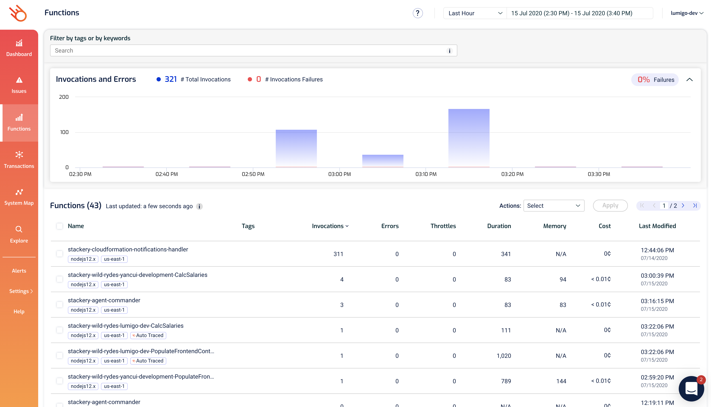

Click into any of the functions to get more details on it:
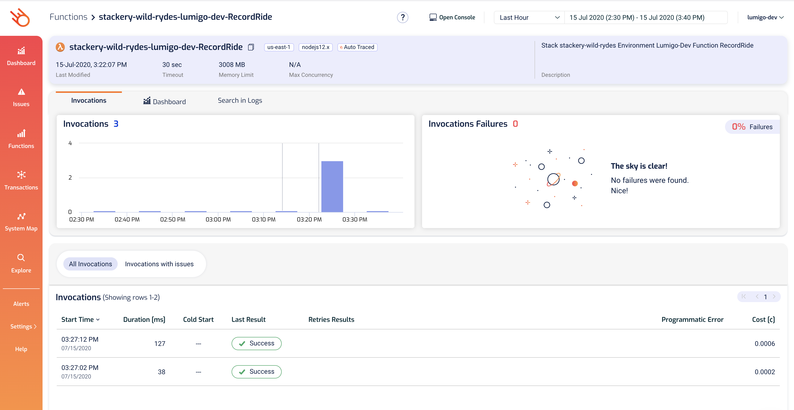

Also, don't forget to check out the [Transactions](https://platform.lumigo.io/transactions) page to see the recent transactions that Lumigo has traced:
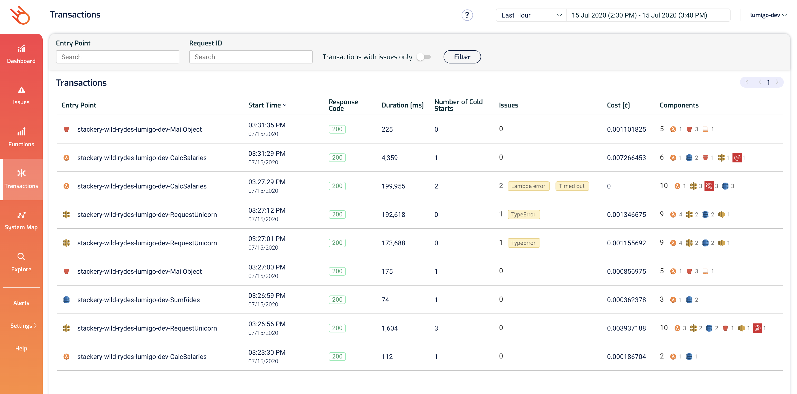

In this page, if you click on one of the transactions then you can see what happened on that transaction alongside the logs for all the participating functions
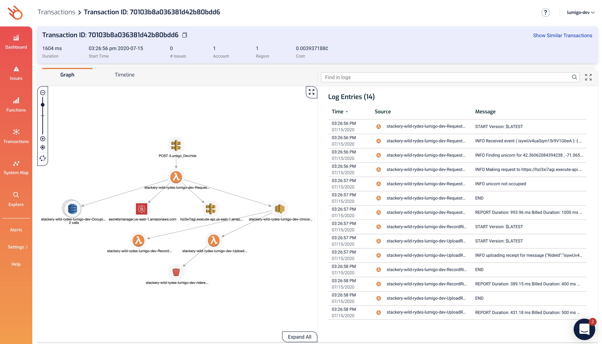

If you click on any of the icons in the graph, you can see even more information about that service, including any request and response to and fro the service.
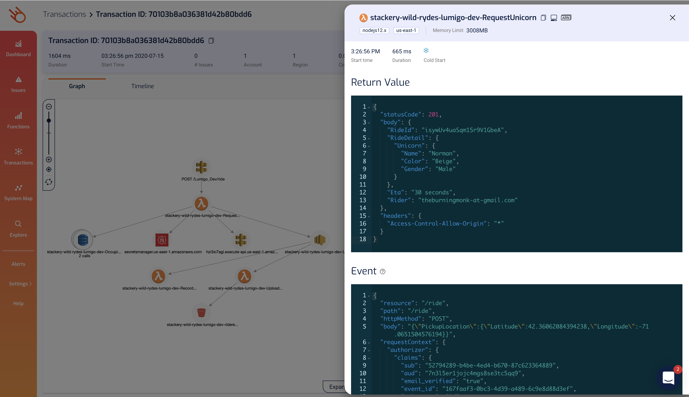
This makes it easy for you to understand what **actually happened** during this transaction without spraying your code with trace statements!

Oh, and one final thing, click on `Timeline` shows you where the time was spent on this transaction to help you identify culprits when performance issues arise.
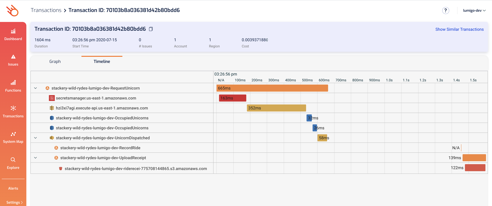

## Next Steps
Proceed to the next module in this workshop:

* [Troubleshooting & Distributed Tracing](07-troubleshooting-distributed-tracing.md)
