# Distributed Tracing & Troubleshooting
In this module, we will explore the power of distributed tracing, and learn how to troubleshoot using Lumigo.

## Instructions
### 1. Invoke the application
Here, we will simulate users using the application. Send some consecutive requests, until you receive some "Unicorn not available" notifications. 

### 2. Inspect the transactions using Lumigo
With Lumigo, we can trace the entire flow of the data throughout the application. We will start with a successful transaction.

First, go to the [Functions](https://platform.lumigo.io/functions) page and search for the `RequestUnicorn` function.

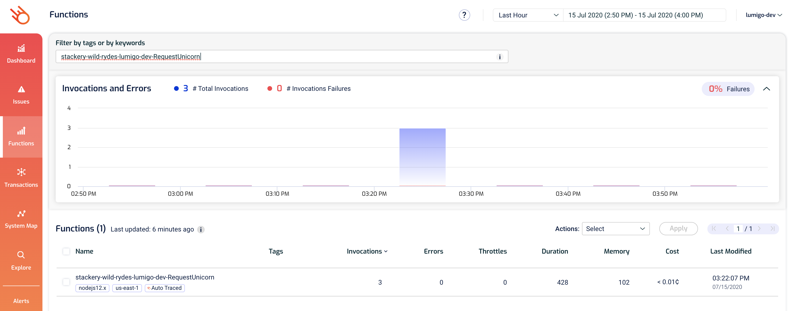

Click on it to see high-level information about this function and its recent transactions (including which transaction involved a cold start).

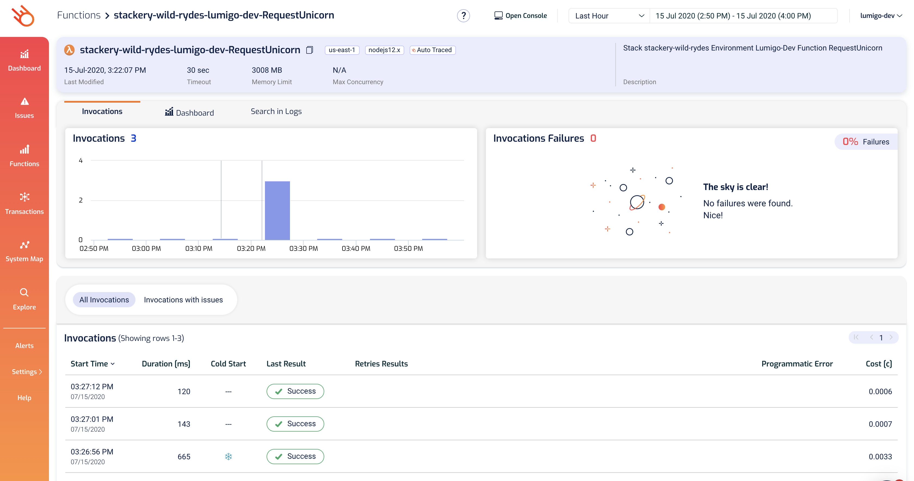

Click on one of the transactions to see what happened. Here we can see the end-to-end transaction involving (but not limited to) this function.

Here, there are multiple participating functions that are triggered by SNS and DynamoDB streams. Not only do we see them nicely laid out for us, but we can also see the logs from all these functions, in chronological order. These helps provide even more context as to what went on during that entire transaction and we don't have to jump between different screens, **everything we need is in one plage**!

If you want to drill even deeper, e.g. if you want to see what message was published to SNS, then click on the SNS icon in the graph.

This opens up a dialogue and shows you the information that has been captured for this request, including the SNS message body.

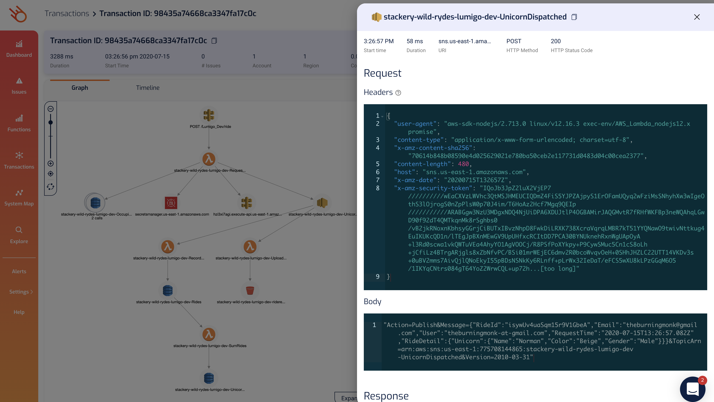

So if you're seeing weird behaviour in the SNS functions or the data being written into the DynamoDB table doesn't make sense, then you can easily trace back to what was sent to SNS in the first place.

No more guessing, no more regret that you didn't log the SNS body as a debug message, let Lumigo handle that for you so you can focus on the business logic. After all, isn't that the promise of serverless?

You can click on every icon in the graph to see what information Lumigo has collected on these requests. Generally speaking, Lumigo cobellects the request and response for every operation you make from Lambda. However, you wouldn't want your application secrets or otherwise sensitive data to be recorded in another service, would you?

To protect your security, Lumigo doesn't collect the payload data for Secrets Manager by default.

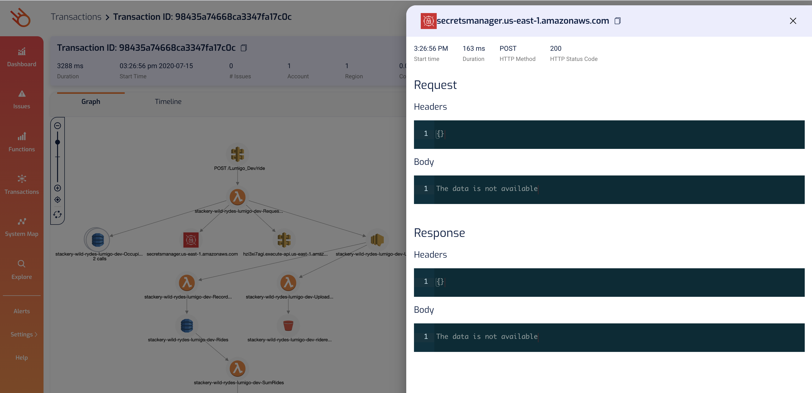

Similarly, HTTP request bodies and some HTTP headers (such as `x-api-key` in the screenshot) are never sent outside of your account.

You can also supply your own secret mask to redact other secrets/sensitive data in your application. See the [Lumigo documentation](https://docs.lumigo.io/docs/secret-masking) for more details.

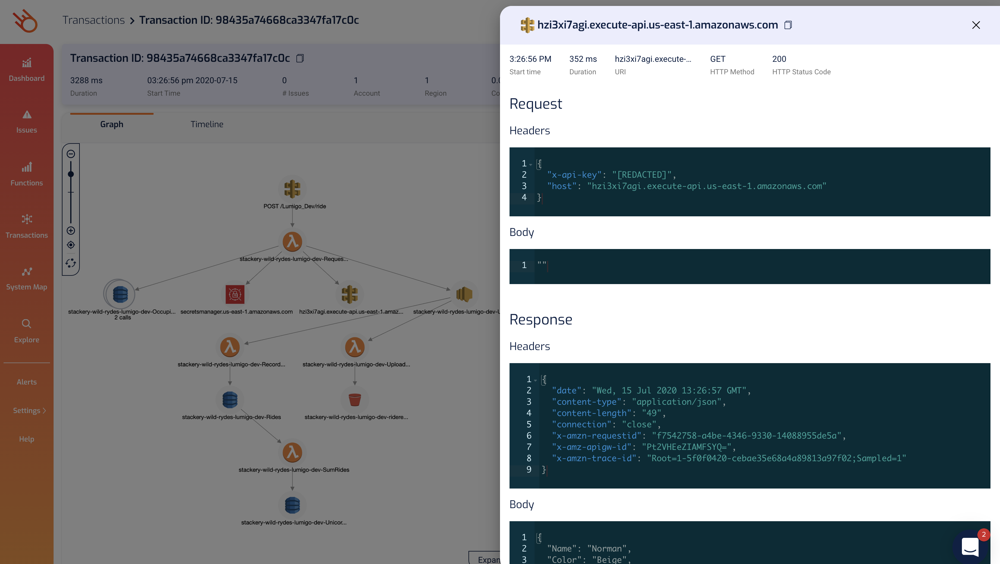

### 3. Troubleshooting issues in transactions
Earlier, we encountered some "Unicorn not available" errors in the application. Let's go to Lumigo to find out what happened.

Head over to the [Transactions](https://platform.lumigo.io/transactions) page, toggle the `Transactions with issues only` option and click `Filter`.

Aha! Now we see the problematic transactions.

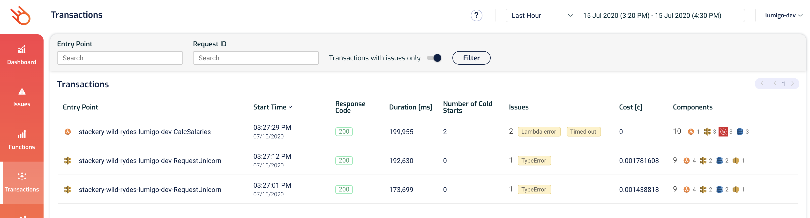

Go to one of the failed `RequestUnicorn` transactions.

Ahhh, so the problem is with the `UploadReceipt` function, and that it was retried 3 times but still failed.

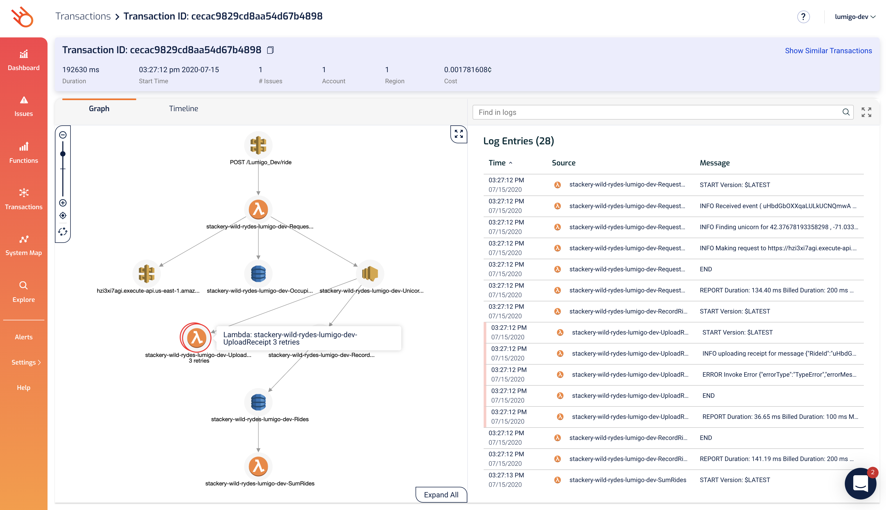

Clicking on its icon shows us that the error was `Cannot read property 'Name' of undefined`.

Looking at the `Event`, notice that `RideDetail` is an empty object `{}`. Given the error, this seems like a plausible starting point. Perhaps the `RideDetail` object is supposed to have some, well, details... maybe the name of a unicorn.

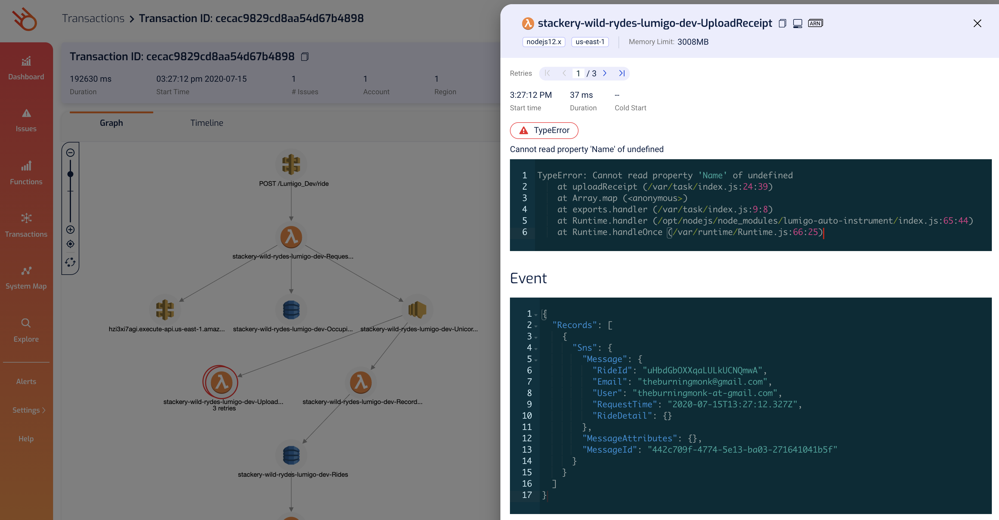

We have the logs for this function right next to the graph. And we can see that just before the error, there was another log message that says `uploading receipt for message ...`. Mmm... it doesn't really help us.

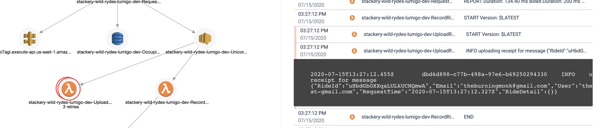

Now, to test the hypothesis that the problem here is that `RideDetail` is empty, let's find a successful transaction to see how it differs from this transaction.

On the top right of this transaction view, right-click `Show Similar Transactions` and open the link in a new tab.

This opens the [Transactions](https://platform.lumigo.io/transactions) with the `Entry Point` filtered to the `RequestUnicorn` function already. And luckily for us, there's a successful transaction here, let's go into it.

Ok, so on a successful transaction, the `UploadReceipt` function would calls DynamoDB. So perhaps the error happened when it was trying to compose the DynamoDB request (hence why it was trying to read a `Name` property from something).

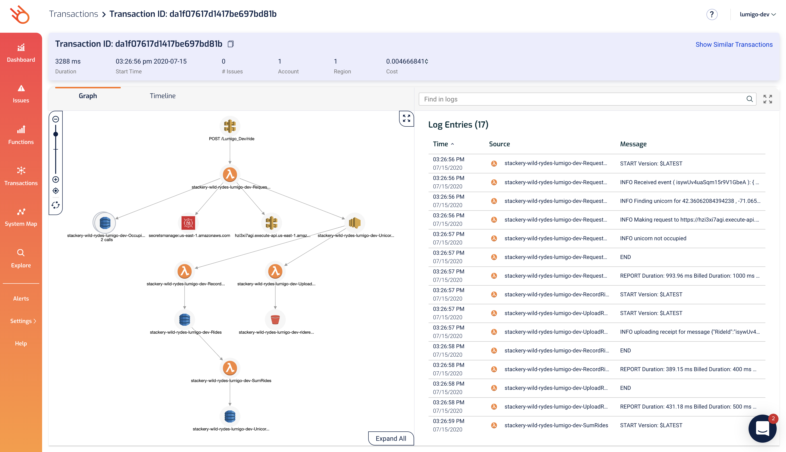

Click on the `UploadReceipt` function to see if we can find more clues.

Voila! On successful transactions, the `RideDetail` object contains a `Unicorn` property with `Name`, `Color` and `Gender`. That's why our code is failing.

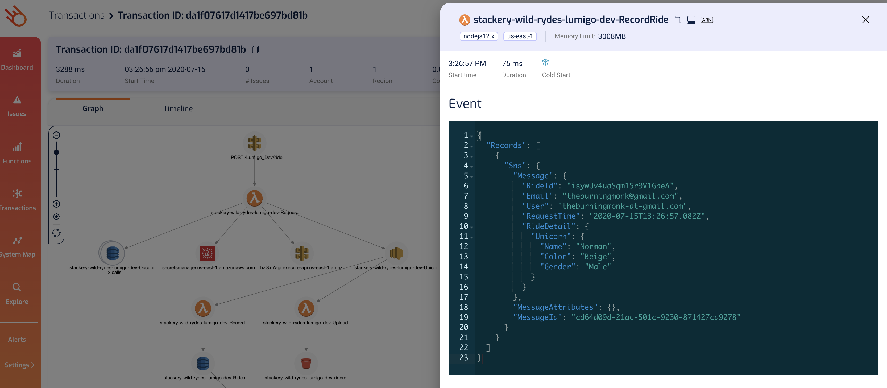

### 4. Optional - fix the error
Don't publish the SNS message when a unicorn is not available.

## Next Steps

Proceed to the next module in this workshop:

* [Monitoring](08-monitoring.md)
