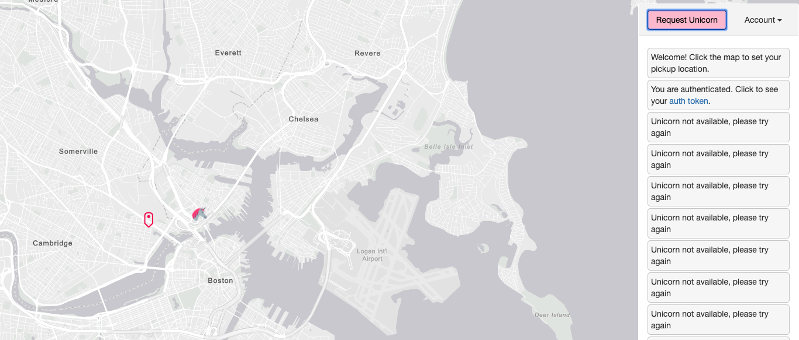
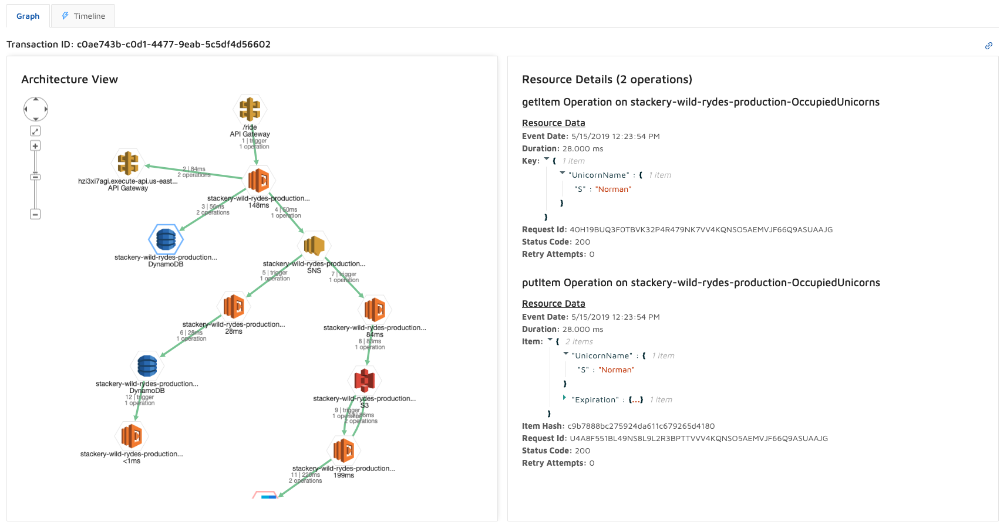
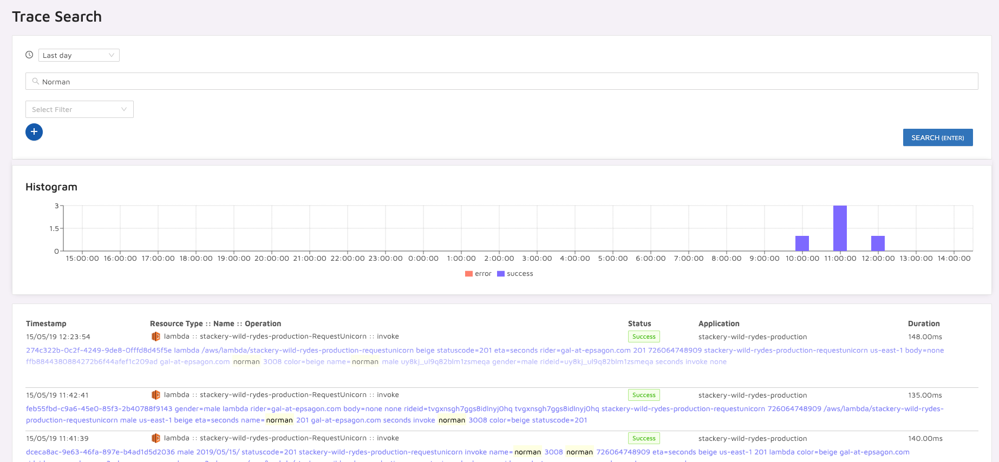
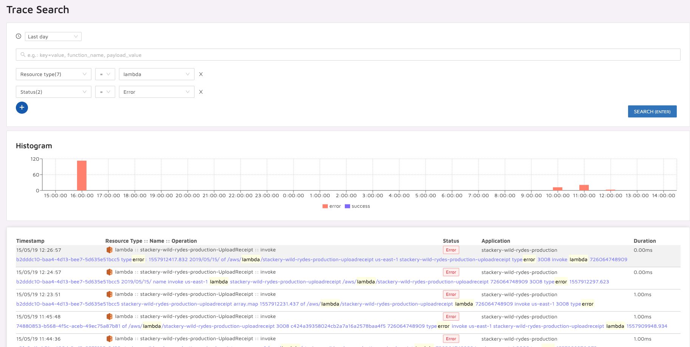

# Distributed Tracing & Troubleshooting
In this module, we will explore the power of distributed tracing, and learn how
to troubleshoot using Epsagon.

# Instructions
### 1. Invoke the application
Here, we will simulate users using the application. Send some consecutive
requests, until you receive some "Unicorn not available" notifications. 



### 2. Inspect the transactions using Epsagon
With Epsagon, we can trace the entire flow of the data throughout the
application. We will start with a successful transaction.

First, enter the [Functions](https://dashboard.epsagon.com/functions) page and
select `stackery-wild-rydes-production-RequestUnicorn`. there you can see all
the API invocations in the system.


Then, select a successful invocation. Note that you can drill into the data of
every event.



### 3. Search for transactions
Using Epsagon, you can filter the transactions in your system based on
the data they contain. Let's give it a shot.

Search for all the transactions where a unicorn with a specific name was
dispatched. To do that, we can use the
[Event search](https://dashboard.epsagon.com/search). Search for all the
transactions for your favorite unicorn:



### 4. Troubleshoot an error
Next, select a transaction with an error. Troubleshoot the root cause of the
error using it (don't fix it yet). You can filter errors in the system using
the [Event search](https://dashboard.epsagon.com/search). Search for all the
events with resource type `lambda` and status `Error`:


Another way to view the issues in your application is the 
[Issue manager](https://dashboard.epsagon.com/issues):


What is causing error? Find the root cause!

<details>
<summary> Open to reveal the solution</summary>
<br>
When a user requests a unicorn and the selected one is not available (the 
OccupiedUnicorns DB reports it as busy), a message is still being dispatched
to the `UnicornDispached` SNS! This causes a faulty message to pass downstream
 and the next function malfunctions.
</details>

### 5. Manually reporting errors
The `SumRides` function is a stream handler. Stream Handlers are often wrapped 
with a try/catch block to prevent the stream from getting stuck. The previous
error caused an issue with it as well. To view the error in Epsagon (without
having the Lambda raising an exception and blocking the stream) we can simply
report it.

Change the function code to report the error to Epsagon. First, require
Epsagon (no need to install it, Stackery will make sure it is there):
```javascript
const epsagon = require('epsagon')
```
Then, in the catch block of the main handler function, simply call `setError`
```javascript
  try {
  // original code
  } catch (e) {
    epsagon.setError(e)
  }
```

### 6. Optional - fix the error
Fix the error! don't publish the SNS message when a unicorn is not available!

## Next Steps

Proceed to the next module in this workshop:

* [Monitoring](08-monitoring.md)
