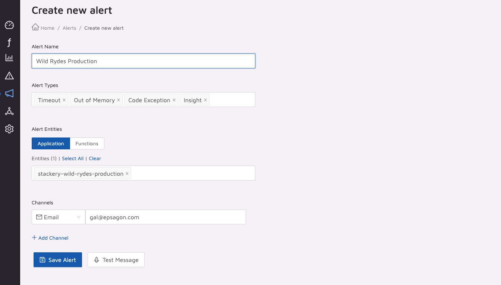
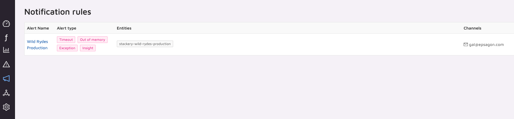
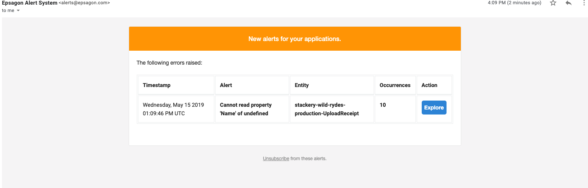

# Monitoring
In this module, we will set up monitoring for our application.

# Instructions
### 1. Configure alerts for your application
To be able to react to issues in your application, you can configure
alerts for your application. 
First, go to
[Notification rules](https://dashboard.epsagon.com/alerts), and select 
[Create New](https://dashboard.epsagon.com/alerts/new). Create an alert for the
`stackery-wild-rydes-production` application:

after your alert was created, you can manage it in the
[Notification rules](https://dashboard.epsagon.com/alerts) tab:

### 2. Trigger an error in the application
Trigger an alert in the application (like in the previous modules). You
will receive an alert via the medium you configured:

## Next Steps

Proceed to the next module in this workshop:

* [Performance Monitoring](09-performance-monitoring.md)
