# Performance Monitoring
In this module, we will learn how to monitor the performance of our application and will also troubleshoot some Lambda-specific issues that can occur in your system.

## Instructions
### 1. Request 10 Unicorn rides
This will trigger our application.

### 2. Find the issue with the application
There is another issue with the application, let's find it!

Go to the [Transactions](https://platform.lumigo.io/transactions) page. Once again, toggle the `Transactions with issues only` button and hit `Filter`.

Looks like the `CalcSalaries` function has been timing out.

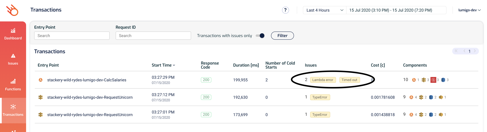

Another way to quickly find issues in your system is to go to the [Issues](https://platform.lumigo.io/issues) page.

We already dealt with the `TypeError` problem with the `UploadReceipt` function, so let's click on the `CalcSalaries` function to see why it's timing out.

This takes us to the function details page where we can see that it's got a fair few timeouts over the last few hours.

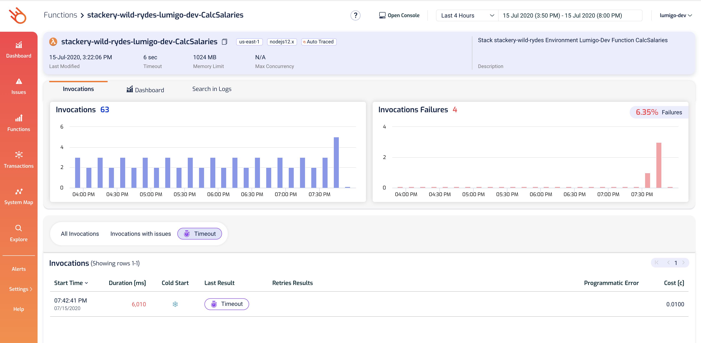

Click on one of the transactions in the list (which is already filtered with the `TimedOut` error since we navigated here through the issues page) takes us to the [Transactions](https://platform.lumigo.io/transaction) view.

As you can tell from the logs on the right, it's been retried twice already, and all three attempts timed out after 6s.

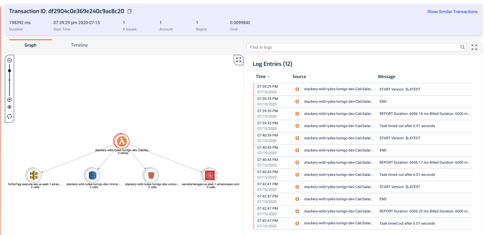

Click on the `Timeline` tab above the graph would tell us what happened.

Here we can see the timeline for all three invocations, and notice that there's a HTTP request to `http://hzi3xi7agi.execute-api.us-east-1.amazonaws.com/` which is marked as `N/A` for its duration?

This is how Lumigo represents an unfinished HTTP request because the function timed out.

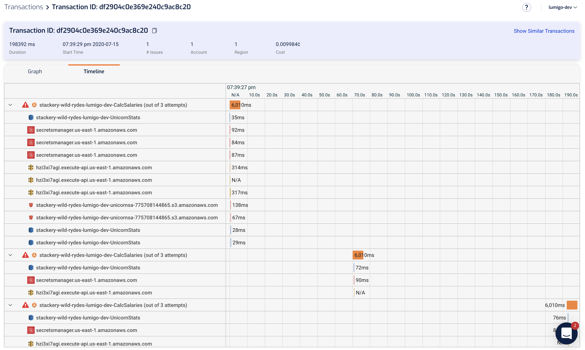

Click on that row to see more information about it, and you can see that the request to `https://hzi3xi7agi.execute-api.us-east-1.amazonaws.com/development/unicorn/Norman` never completed and that's why our function timed out (3 times!).

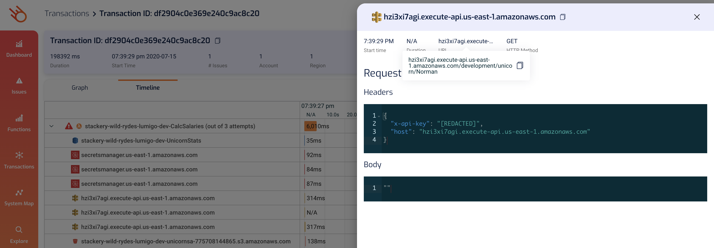

In this case, we started by asking the question "has there been any issues?" in the [Issues](https://platform.lumigo.io/issues) page and then navigate to the relevant transactions to debug the problem.

What many performance problems don't result in issues such as timeouts. But even when the functions don't time out (which results in a 502 error to the caller), slow responses can still negatively impact user experience, which in turn, can [affect your sales revenue](https://www.gigaspaces.com/blog/amazon-found-every-100ms-of-latency-cost-them-1-in-sales/), user retention and other important business KPIs.

Luckily, Lumigo makes it easy for you to catch those problems too.

### 3. Explore
Lumigo lets you explore and query all the data that it records on your system. If you go to the [Explore](https://platform.lumigo.io/search) page you can see the data Lumigo has recorded.

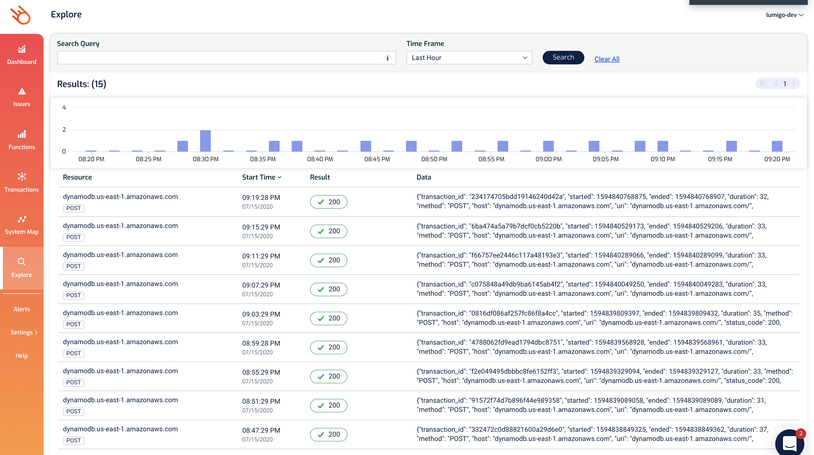

If you want to find other things that are slow (e.g. taking more than 500ms) then you can use a flexible query language to explore all the data Lumigo has for your application.

For example, try entering the query `duration: >500` in the `Search Query` box and hit `Search`. You might see something like this:

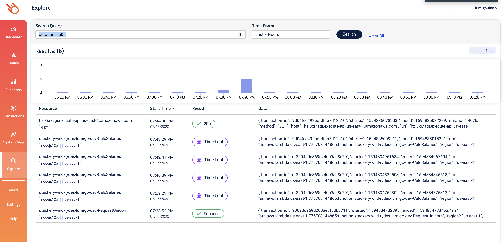

Here, you can see the `CalcSalaries` invocations that timed out, but you can also see successful operations that were just a bit slower than you'd like.

Take the top row on `hzi3xi7agi.execute-api.us-east-1.amazonaws.com` for instance. If you click on the row to expand it, you can see that this HTTP request took a whole 4 second to complete!

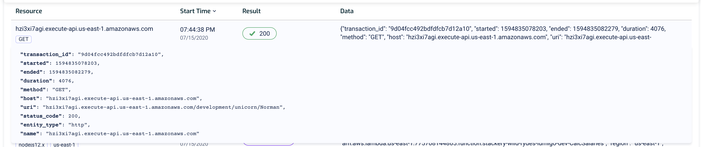

If you click on the hyperlinked resource name it'll take you to the [Transaction](https://platform.lumigo.io/transactions) view which that HTTP request was part of.

You can see that this slow HTTP request was part of the `CalcSalaries` function. From the logs you can see it timed out the first time, but then succeeded on retry, although the retry also took over 5s.

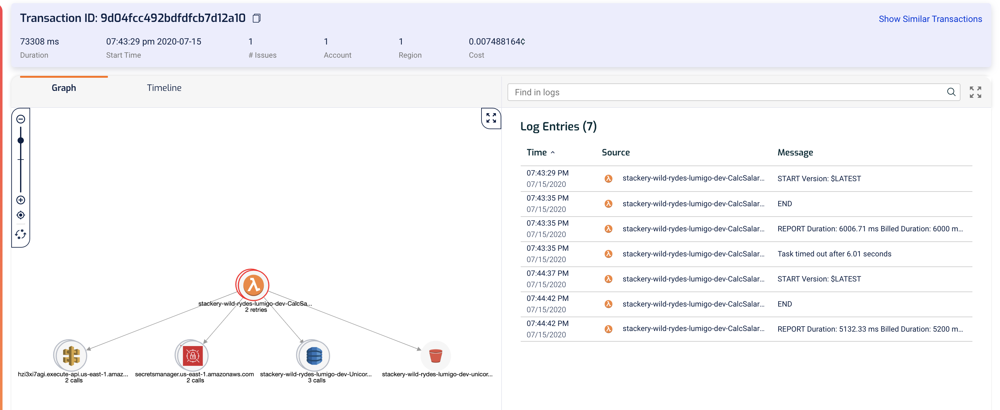

Clicking on the `Timeline` tab shows me where the slow HTTP request comes in.

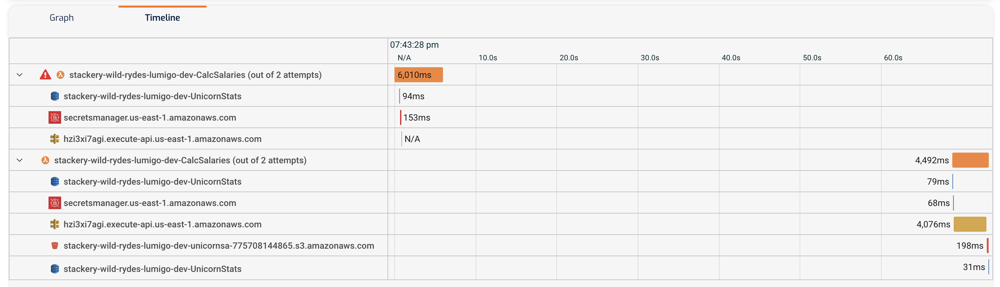

### 4. Finding other latencies problems

The most likely performance problem in a serverless application comes from slow integration points - i.e. other services that your Lambda functions have to call. These can include AWS services such as DynamoDB and SNS, but can also be external endpoints, like the `http://hzi3xi7agi.execute-api.us-east-1.amazonaws.com/` endpoint we configured as parameter in earlier modules.

In the Lumigo [Dashboard](https://platform.lumigo.io/dashboard), there's a `Services Latency` widget on the bottom right.

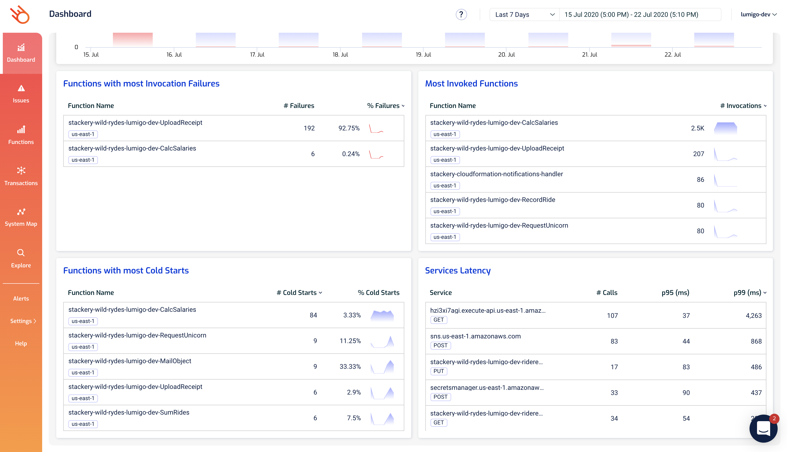

Notice that the `p99` latency for `hzi3xi7agi.execute-api.us-east-1.amazonaws.com` is really high! So something's definitely up with that service.

If you click on the `p99` value (not the service url), it will take you to the [Explore](https://platform.lumigo.io/search) page. The page is already prefilled with a query that shows you the slowest queries.

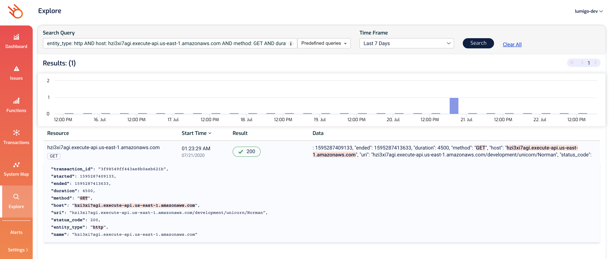

We can see that this endpoint took a whole 4.5s to respond on this occassion From here, we can navigate to the relevant transaction by clicking on `Resource` name.

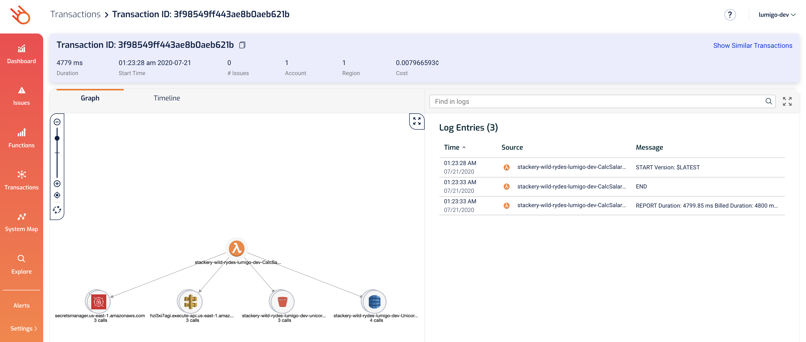

As you can see, this invocation completed successfully, but it took 4799.85ms, not the kinda user experience we want to give to our users!

Looking at the `Timeline` of this transaction, you can see that, not only did that one request took 4.5s, other requests to the same service also took hundreds of ms to respond.

## Request a demo

If you want to see a more in-depth demo of what Lumigo can do for you, please get in touch with [me](mailto:yan@lumigo.io) and we can arrange something at a time that suits you.
