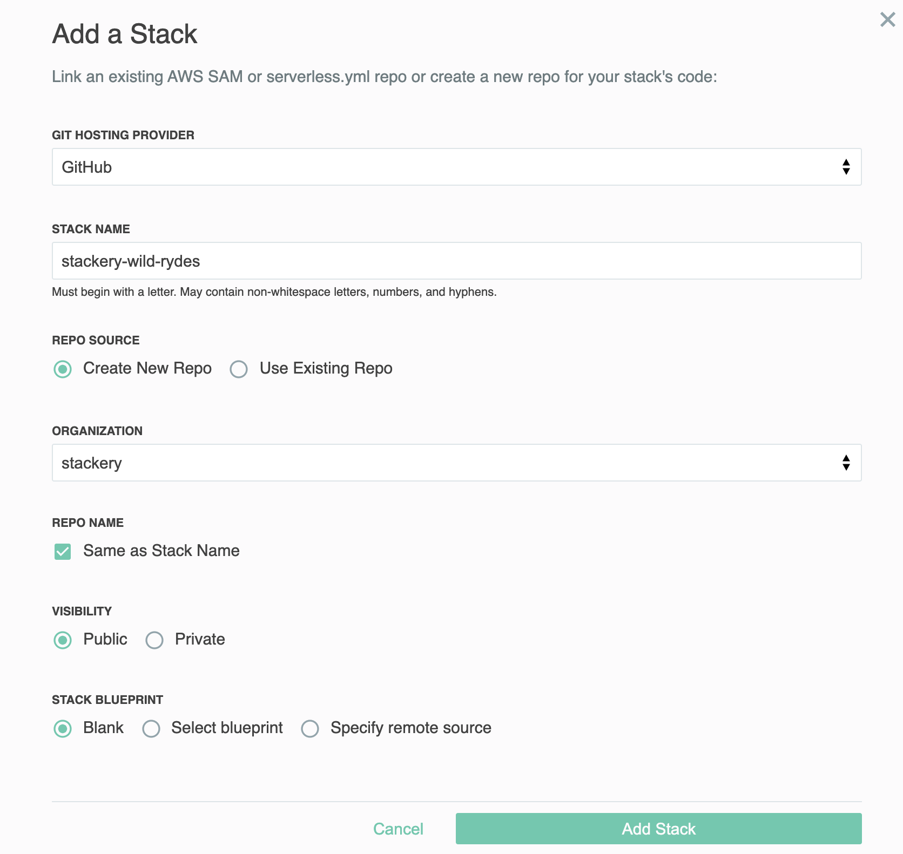
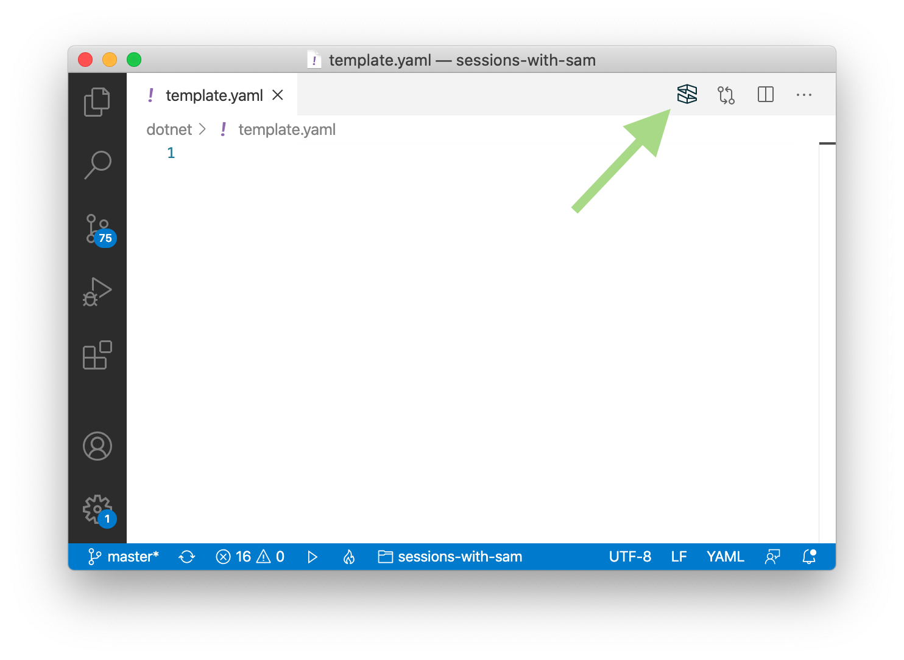

# Wild Rydes With Stackery

In this workshop you will deploy a simple serverless application using [Stackery](https://stackery.io). The application is a unicorn ride hailing service called Wild Rydes. The Wild Rydes application is a three tier web application composed of a frontend web application, a RESTful web services backend API, and a NoSQL data layer. This workshop will also cover common topics for building serverless applications like secrets management and user authentication, authorization, and management.

The application architecture uses the following AWS services.

* [Lambda](https://aws.amazon.com/lambda/) - Backend API compute
* [API Gateway](https://aws.amazon.com/api-gateway/) - Backend HTTP interface
* [DynamoDB](https://aws.amazon.com/dynamodb/) - NoSQL datastore
* [S3](https://aws.amazon.com/s3/) - Object store for hosting frontend.
* [AWS CodeBuild for deploying static website content](https://docs.stackery.io/docs/api/nodes/Website/)
* [Cognito](https://aws.amazon.com/cognito/) - user management, authentication, and authorization.

Before you begin this workshop please make sure you have completed the steps in the *Setup / Prerequisites* section of this documentation.

## Table of Contents

1) [Frontend](./01-frontend.md)
1) [User Management](./02-user-management.md)
1) [Environment Parameters & Secrets](./03-environment-parameters.md)
1) [Backend API](./04-backend-api.md)
1) [Production Deployment](./05-production.md)
1) [Application Observability](06-application-observability.md)
1) [Distributed Tracing & Troubleshooting](07-troubleshooting-distributed-tracing.md)
1) [Monitoring](./08-monitoring.md)
1) [Performance Monitoring](./09-performance-monitoring.md)

## Setup / Prerequisites

To complete this workshop you will need the following:

* Software:
  * A text editor or programming IDE
  * <a href="https://nodejs.org/en/" target="_blank" alt="NodeJS">Node.js + Node Package Manager (npm)</a>
  * <a href="https://docs.aws.amazon.com/cli/latest/userguide/cli-chap-install.html" target="_blank" alt="AWS SAM CLI">The AWS CLI</a>
  * <a href="https://docs.aws.amazon.com/serverless-application-model/latest/developerguide/serverless-sam-cli-install.html" target="_blank" alt="AWS SAM CLI">The AWS SAM CLI</a>
* Accounts
  * AWS
  * Stackery
  * Lumigo

> Be sure the laptop you are using during the workshop can run a terminal or shell. For example, if you are using a Chromebook, make sure it has the ability to boot into Linux. MacOS, Linux, or Windows laptops should work without any changes required.

At a minimum you will need to create a Stackery account. Follow the instructions below to setup what you need to get started and complete this workshop.


### 1. Create an AWS account

Create an AWS account if you do not already have one. The workshop's application is built to run in AWS.

To create an AWS account, click on the link below and follow the signup screens. You'll provide your email address, create a password, and give your account a name.

* [Create an AWS account](https://portal.aws.amazon.com/billing/signup)

**You will need to enter a credit card to complete account setup.** Your card will not be charged unless your account exceeds the free tier usage limits. All of the resources you will launch as part of this workshop are eligible for the [AWS free tier](https://aws.amazon.com/free/) if your account is less than 12 months old. See the [AWS Free Tier](https://aws.amazon.com/free/) page for more details.


### 2. Create a Stackery account

Next, create a Stackery account and link your AWS account to it.


#### Create Stackery Account

> If you are doing the workshop together with team members who will be sharing an AWS account, have only one team member follow this step to create an account. Once the account is set up, go to [User Settings](https://app.stackery.io/settings/users) in Stackery and click **Invite New User** to invite the remaining team members. Each team member can still connect their own Git account, as well as additional AWS accounts as needed.

Click on the link below to bring you to the Stackery signup page.

* [Create a Stackery account](https://stackery.io/sign-up)

<!-- FIXME: IMAGE -->

Once sign up is completed you'll be redirected to the application's welcome page. While on the welcome page, check your mail for an email verification message. You'll need to verify your email before you proceed. Once you have completed this, click the **Next Step** button.

#### Link Stackery to your AWS account

Now link your AWS account to Stackery. Click on the **Link my AWS account** button.

<!-- FIXME: move image to repo -->


This will open up the CloudFormation console (you may be required to login first) with pre-populated parameters. In order to proceed, click the check mark saying you acknowledge the creation of IAM resources, then click the **Create stack** button. This process will take a few minutes as CloudFormation creates the appropriate roles.


#### Get the Stackery CLI

We will be using the [Stackery CLI](https://docs.stackery.io/docs/using-stackery/cli/) to handle stack creation and deployment.

Follow the instructions for your operating system in the setup to download and install the Stackery CLI. Complete the setup by entering:

```bash
stackery login
```

Once you have completed all these steps you should be ready to use Stackery!

### 3. Create the Wild Rydes stack.

Navigate to the stack list page in Stackery: https://app.stackery.io/stacks. Next, select a Git provider to store the stack we're creating. You can name the stack anything you like, say *stackery-wild-rydes*. Make sure to create a new repo, provide any further Git provider-specific settings, and start from a *Blank* template.



In your terminal or IDE, clone your new git repo:

```bash
# Fill in your repo URL below, like git@github.com:stackery/stackery-wild-rydes.git
git clone <repo URL>
```

This will create a directory called `stackery-wild-rydes` that includes a blank `template.yaml` file. The `template.yaml` is an AWS SAM formatted template in which we will create our infrastructure-as-code.

If you have [VS Code](https://code.visualstudio.com/) you can install the Stackery extension which makes template editing a breeze. Click [here](https://marketplace.visualstudio.com/items?itemName=stackery.stackery) to open the extension in the marketplace and install it.

To start editing the template, either:
* In VS Code with the Stackery extension, open the template.yaml file and click the Stackery icon in the top right toolbar
    
* `cd` to the `stackery-wild-rydes` directory you just created, and enter:
    ```bash
    stackery edit
    ```

You may see a login screen:


Log in with your Stackery credentials, then you will be redirected to the blank canvas:


That's where we'll start building our app architecture in the next step.

## Next Steps

Proceed to the next module in this workshop:

* [Frontend](./01-frontend.md)

## Troubleshooting

### What if I hit an error while trying to `git clone` the workshop repo?

You may see the following error when cloning the repo in your Mac terminal: `xcrun: error: invalid active developer path`. This means that you need XCode installed on your machine (even though we won't be using it in this workshop). To install the necessary tools to run git in the terminal, enter `xcode-select --install` and try cloning again when the installation completes.

### Can't log into GitHub on the terminal

If your GitHub account has two-factor authentication enabled, you will need to create an access token to log into your account in the terminal. Go to [github.com/settings/profile](https://github.com/settings/profile), click **Developer Settings**, then **Personal access tokens** and generate a new token. This will be your password when signing in to GitHub in the terminal.

### Getting a CORS error when requesting a unicorn

There are a couple of possible causes of CORS errors in this app. One would be not enabling CORS in the API Gateway, which is covered in the [Add a Rest API resource step](https://github.com/stackery/wild-rydes-workshop/blob/master/04-backend-api.md#7-update-requestunicorn-function).

The other is forgetting to copy the new function code for the `RequestUnicorn` function, which is covered in the [Update RequestUnicorn Function step](https://github.com/stackery/wild-rydes-workshop/blob/master/04-backend-api.md#7-update-requestunicorn-function).

If you have completed both steps and are still getting a CORS error in the console, please notify a team member and we'll help you debug.

### Prepare or deployment fails in Stackery

There are several reasons a change set can fail to prepare or deploy, including template formatting errors or lacking the required environment parameters. If your stack fails to prepare or deploy at any point during the workshop, please grab a Stackery team member - we'll be happy to help you out!